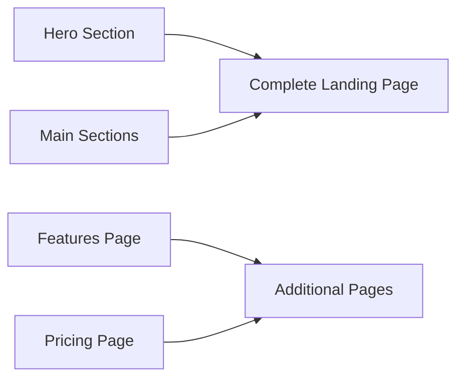
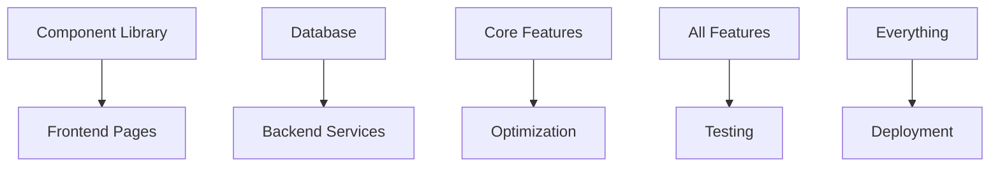

# VP of One - Phase 2 Architecture

## 🎯 Overview

Phase 2 transforms the VP of One foundation into a production-ready platform through 5 parallel development streams. This phase compresses 32 hours of sequential work into 3 hours of parallel execution.

## 🌊 Development Streams

### Stream 1: Frontend Development (4 agents)
**Purpose**: Build the complete user-facing experience
**Priority**: CRITICAL for hero and main sections



**Tasks:**
1. **Hero Section** (CRITICAL, 2h)
   - "Punch Above Your Weight" headline
   - Dual CTAs (Strategy Session + See How It Works)
   - 3 supporting value points
   - Conversion-optimized design

2. **Main Page Sections** (CRITICAL, 3h)
   - Pain Points with icons
   - Solution showcase (4 AI assistants)
   - Benefits with metrics
   - How It Works process

3. **Features Page** (MEDIUM, 2h)
   - Detailed AI assistant capabilities
   - Use cases and examples
   - Benefits breakdown

4. **Pricing Page** (MEDIUM, 2h)
   - Custom pricing philosophy
   - ROI calculator component
   - Consultation CTA

### Stream 2: Component Library (2 agents)
**Purpose**: Create reusable UI building blocks
**Priority**: HIGH - enables other UI work

**Form Components (3h):**
- Input, Textarea, Select
- Checkbox, Radio
- FormField with validation
- ConsultationForm component

**Layout Components (2h):**
- Container, Section
- Grid system
- Card, Badge
- Divider

### Stream 3: Backend Infrastructure (3 agents)
**Purpose**: Build data persistence and services
**Priority**: HIGH for core functionality

**Database Schema (3h):**
```sql
-- Core tables
consultations
contacts
newsletter_subscribers
analytics_events
conversions
```

**Email Service (2h):**
- SendGrid/similar integration
- Template system
- Transactional emails

**Authentication (3h):**
- JWT implementation
- Admin panel access
- Session management

### Stream 4: Optimization & Quality (3 agents)
**Purpose**: Ensure performance and discoverability
**Priority**: HIGH for production readiness

**Analytics (2h):**
- useAnalytics hook
- Event tracking
- Privacy compliance

**SEO (2h):**
- Meta tags & Open Graph
- Structured data
- Sitemap & robots.txt

**Performance (2h):**
- Image optimization
- Code splitting
- 95+ Lighthouse score

### Stream 5: DevOps & Testing (2 agents)
**Purpose**: Enable deployment and quality assurance
**Priority**: HIGH for deployment, MEDIUM for testing

**Deployment (2h):**
- Vercel configuration
- Environment management
- CI/CD setup

**Testing (2h):**
- Jest + React Testing Library
- Critical path tests
- API endpoint tests

## 📊 Parallelization Strategy

```
Time →
Hour 1: [Hero] [Forms] [Database] [Analytics] [Deploy]
Hour 2: [Hero] [Forms] [Database] [Analytics] [Deploy]
        [Main] [Layout] [Email]   [SEO]      [Tests]
Hour 3: [Main] [Layout] [Auth]    [Perf]     [Tests]
        [Main]          [Auth]
        [Features]
        [Pricing]
```

## 🚀 Execution Priorities

### Critical Path (Do First):
1. Hero Section
2. Main Page Sections
3. Form Components (enables consultation booking)

### High Priority (Do Next):
1. Database Setup
2. Analytics Integration
3. Deployment Configuration
4. SEO Implementation

### Medium Priority (Do After):
1. Additional Pages
2. Authentication
3. Performance Optimization
4. Testing Framework

## 💡 Stream Dependencies



## 🎯 Success Metrics

Each stream has clear completion criteria:
- **Frontend**: User can navigate and interact with all pages
- **Components**: All forms validate and submit
- **Backend**: Data persists and emails send
- **Optimization**: 95+ Lighthouse, analytics tracking works
- **DevOps**: Site deploys to production

## 🔄 Iteration Strategy

After initial parallel execution:
1. Run phase 2 orchestrator to check progress
2. Address any failed tasks
3. Move to integration testing
4. Deploy to staging
5. Prepare for Phase 3 (launch preparation)

## 🏗️ Architecture Decisions

### Why These Streams?
- **Independence**: Each stream can work without blocking others
- **Expertise**: Different skill sets can work simultaneously
- **Value Delivery**: Each stream adds measurable value
- **Risk Mitigation**: Failures in one stream don't block others

### Technology Choices
- **Prisma**: Type-safe database access
- **SendGrid**: Reliable email delivery
- **JWT**: Stateless authentication
- **Vercel**: Optimized Next.js hosting

## 📈 Expected Outcomes

By completing Phase 2:
- Fully functional landing page with conversion optimization
- Complete component library for rapid development
- Production-ready backend with data persistence
- Analytics and SEO ready for launch
- Automated deployment pipeline

**Total Time Saved**: 29 hours (91% reduction through parallelization) 